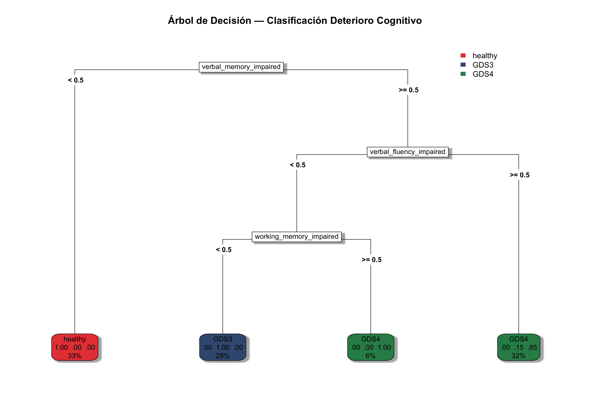
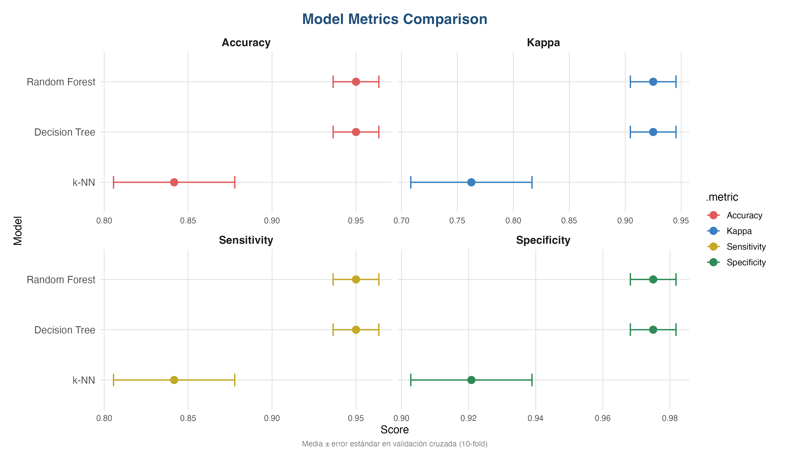

# Clasificación de deterioro cognitivo con un árbol de decisión (R · tidymodels)


Se trata de un proyecto para clasificar 150 pacientes en 3 grupos clínicos: — **sanos**, **deterioro cognitivo leve (GDS 3)** y **deterioro cognitivo moderado (GDS 4)** — a partir de ocho indicadores neuropsicológicos binarios. El objetivo es un modelo preciso **y** legible: un conjunto corto de reglas que un profesional pueda seguir. No es una herramienta diagnóstica.

> **Proyecto académico.** Práctica de la asignatura *Aprendizaje Automático Supervisado* (curso 2025-26). No es una herramienta diagnóstica.

## Resultados principales

| | |
|---|---|
| Datos | 150 pacientes, 3 grupos equilibrados (50 c/u), 8 predictores binarios (preservado / alterado) |
| Partición | 80/20 estratificada, `set.seed(123)` → 120 entrenamiento / 30 test |
| Ajuste | grid aleatorio de 20 combinaciones, validación cruzada 10-fold estratificada |
| Árbol seleccionado | `cost_complexity ≈ 2.4e-10`, `tree_depth = 7`, `min_n = 14` |
| Accuracy en CV | 0.950 (EE 0.014) |
| **Accuracy en test** | **30/30 (100%)** — IC 95% exacto: 88.4–100% |

**Reglas clínicas del árbol (3 preguntas):**

1. ¿Está alterada la memoria verbal? **No → sano.**
2. Si lo está: ¿está alterada la fluidez verbal? **Sí → GDS 4.**
3. Si la fluidez está preservada: ¿está alterada la memoria de trabajo? **No → GDS 3**, **sí → GDS 4.**



### Comparación con otros modelos (CV 10-fold, mismas folds y receta)

| Modelo | Accuracy | Kappa | Sensibilidad | Especificidad |
|---|---|---|---|---|
| Árbol de decisión | 0.950 ± 0.014 | 0.925 | 0.950 | 0.975 |
| Random forest (500 árboles) | 0.950 ± 0.014 | 0.925 | 0.950 | 0.975 |
| k-NN (k = 5) | 0.842 ± 0.036 | 0.762 | 0.842 | 0.921 |

El árbol individual iguala al random forest y conserva toda su interpretabilidad.



## Estructura del repositorio

```
├── R/arbol_decision.R      # análisis completo, de principio a fin
├── data/data_set.sav       # conjunto de datos (ver "Datos")
├── figures/                # gráficos generados por el script
├── report/                 # informe completo
└── README.md
```

## Cómo reproducirlo

Requiere R ≥ 4.2.

```r
install.packages(c("tidymodels", "foreign", "rpart", "rpart.plot",
                   "ranger", "kknn", "scales", "forcats"))

# desde la raíz del repositorio
source("R/arbol_decision.R")
```

El script imprime los resultados del ajuste y las métricas en test, y guarda todas las figuras en `figures/`.

## Método

- **Preprocesamiento:** `recipes` — `step_dummy()` sobre todos los predictores nominales (p. ej. `verbal_memory_impaired`).
- **Modelo:** `decision_tree()` con motor `rpart`; se optimizan `cost_complexity`, `tree_depth` y `min_n`.
- **Validación:** CV 10-fold estratificada para el ajuste; ajuste final con `last_fit()` sobre el test, que no se toca antes.
- **Métricas:** accuracy, kappa de Cohen, sensibilidad y especificidad (macro).

## Datos

`data/data_set.sav` — *Conjunto de datos neuropsicológicos simulados con fines docentes (formato SPSS). Los perfiles de rendimiento cognitivo y las etiquetas diagnósticas fueron generados sintéticamente para modelar la progresión del deterioro, sin contener información real ni sensible de pacientes.*

## Limitaciones y próximos pasos

- Muestra pequeña (n = 150) y artificialmente equilibrada, por lo que no refleja la prevalencia clínica real. Con solo 30 casos de test, el intervalo es amplio incluso con un 100% de accuracy.
- Los predictores binarios pierden información sobre *cuánto* está alterado cada dominio; puntuaciones continuas serían más ricas.
- Las cinco mejores configuraciones empatan en 0.95 de accuracy en CV, así que `select_best()` elige entre empates de forma arbitraria. La regla de un error estándar (`select_by_one_std_err()`) favorecería el árbol más simple.
- Los hiperparámetros del árbol se ajustaron con las mismas folds que luego se usan en la comparación, mientras que random forest y k-NN usan valores por defecto, lo que favorece ligeramente al árbol. Una CV anidada haría la comparación más justa.
- Siguientes pasos: gradient boosting, un grid regular y datos reales desequilibrados.

